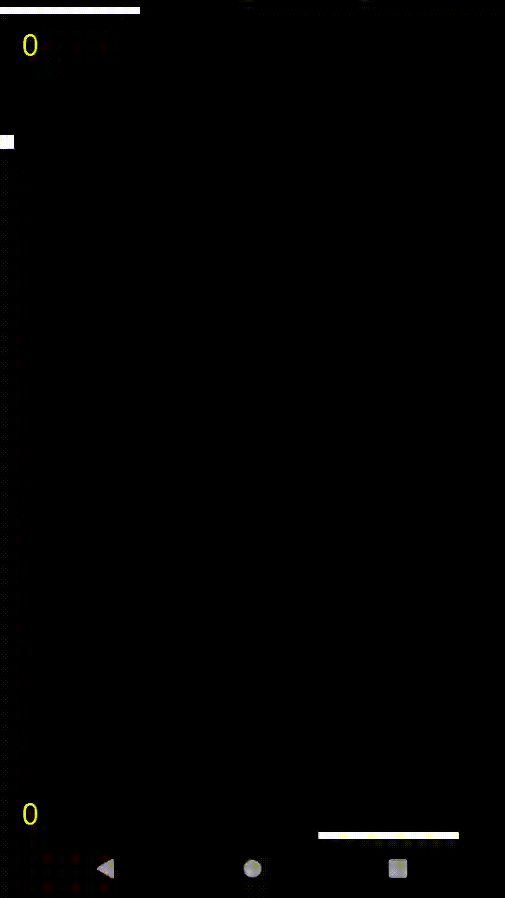

# Pong-game 🏓
A very simple libgdx-project used for an assignment in Software Architecture.

### Task
Implement your own version of the classic game of pong.

* Score is displayed near each paddle.
* Ball changes direction if it is hit by a paddle.
* The "AI" paddle adjusts itself according to the balls X position.
* The player paddle is movable (touch).
* If a paddle misses the ball, score is given to the opposite player, and ball is reset to middle.
* If a side reaches 21 in score, that side wins (either AI or Player).
* Ball increases in speed for each consecutive hit.
* If game finishes, score is displayed with a "Restart game" option.

(Actual game footage!)
